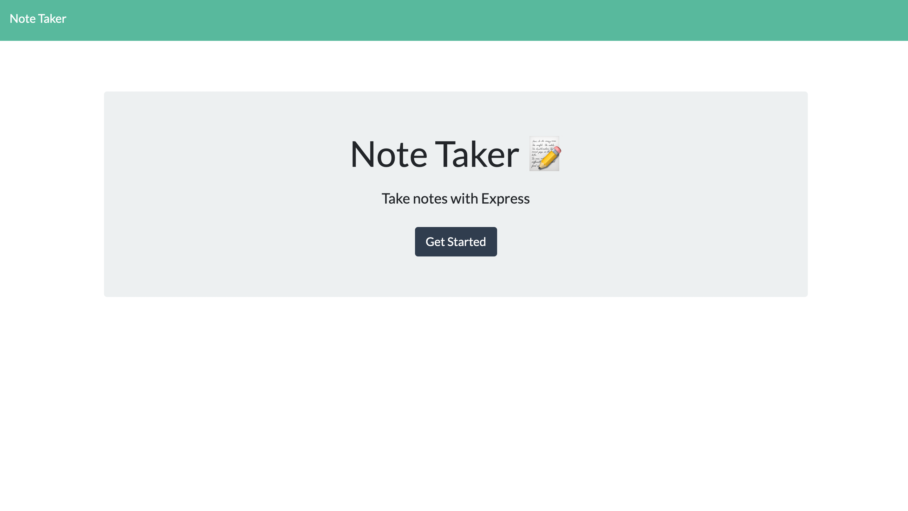
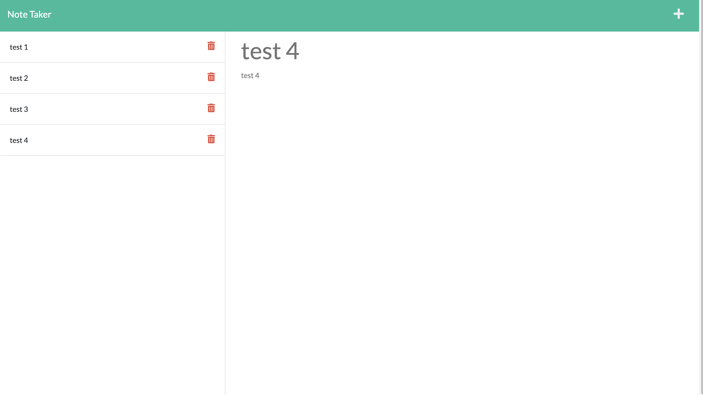
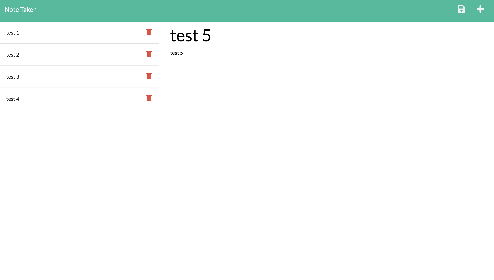

# Note Taker

<p>
    
    
    
    
    
    
</p>


## Table of Contents
1. [Description](#description)
2. [User Story](#user-story)
3. [Screenshot](#screenshot)
4. [Heroku](#heroku)
5. [Installation](#installation)
6. [License](#license)
7. [Contributing](#contributing)
8. [Test](#test)
9. [Questions](#contact-information)

## Description
The Note Taker can be used to write and save notes. This application will use HTML, CSS, and JavaScript front end to layout the application and will use an Express.js back end to save, retrieve and delete note from a JSON file. The application is deployed to [heroku](https://shelldan-note-taker.herokuapp.com/) as well. 


## User Story
```md
AS A small business owner
I WANT to be able to write and save notes
SO THAT I can organize my thoughts and keep track of tasks I need to complete
```

## Screenshot







## Heroku
https://shelldan-note-taker.herokuapp.com/

## Installation
To clone the repo:
```
git clone https://github.com/shelldan/node-taker.git
``` 
Run 'npm install' to install dependencies

Run 'npm run develop' to start the program

App listening at http://localhost:3001 

---

## License
[](https://opensource.org/licenses/MIT) 

## Contributing 
To contribute to this application, create a pull request.
Here are the steps needed for doing that:
- Fork the repo
- Create a feature branch (git checkout -b NAME-HERE)
- Commit your new feature (git commit -m 'Add some feature')
- Push your branch (git push)
- Create a new Pull Request

Following a code review, your feature will be merged.

---

## Test:
It is recommended that you follow this workflow:

1. When you open the Note Taker, then you should be presented with a landing page with a link to a notes page
2. When you click on the link to the notes page, you should be presented with a page with existing notes listed in the left-hand column, plus empty fields to enter a new note title and the note's text in the right-hand column
3. When you enter a new note title and the note's text, then a Save icon appears in the navigation at the top of the page
4. When you click on the Save icon, then the new note you have entered is saved and appears in the left-hand column with the other existing notes
5. When you click on an existing note in the list in the left-hand column, then that note appears in the right-hand column
6. When you click on the Write icon in the navigation at top of the page, then you should be presented with empty fields to enter a new note title and the note's text in the right hand column.
7. When you click on the Delete icon, then the note you have deleted is removed from the left-hand column

---

## Contact Information
* GitHub Username: [shelldan](https://github.com/shelldan)
